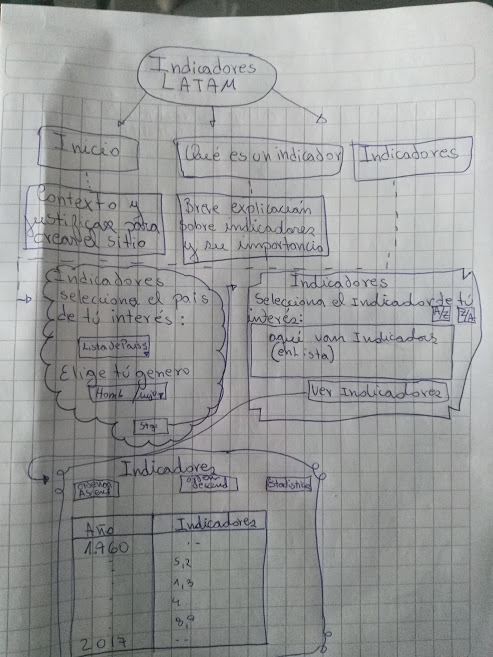
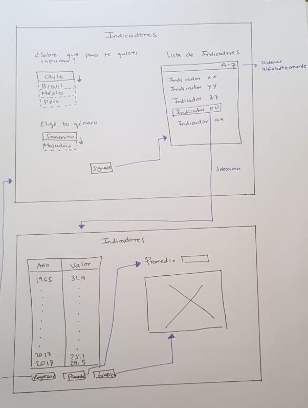
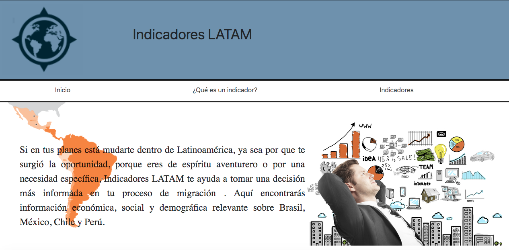
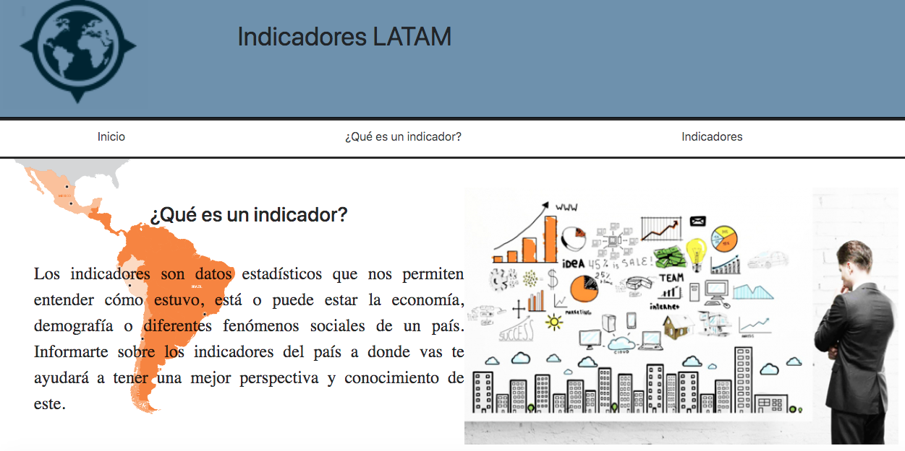
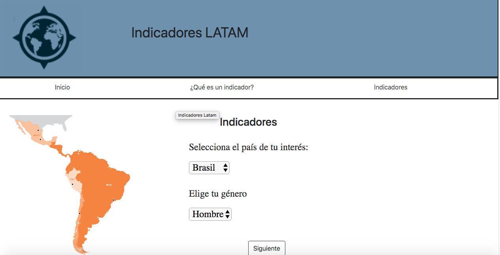
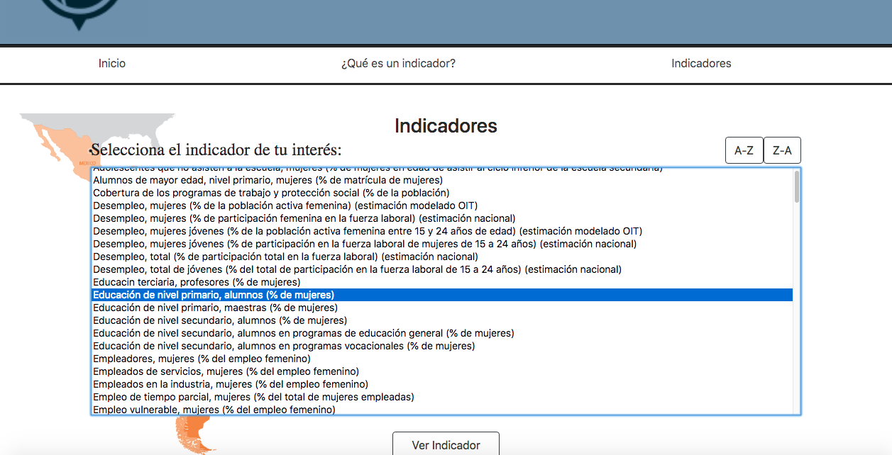
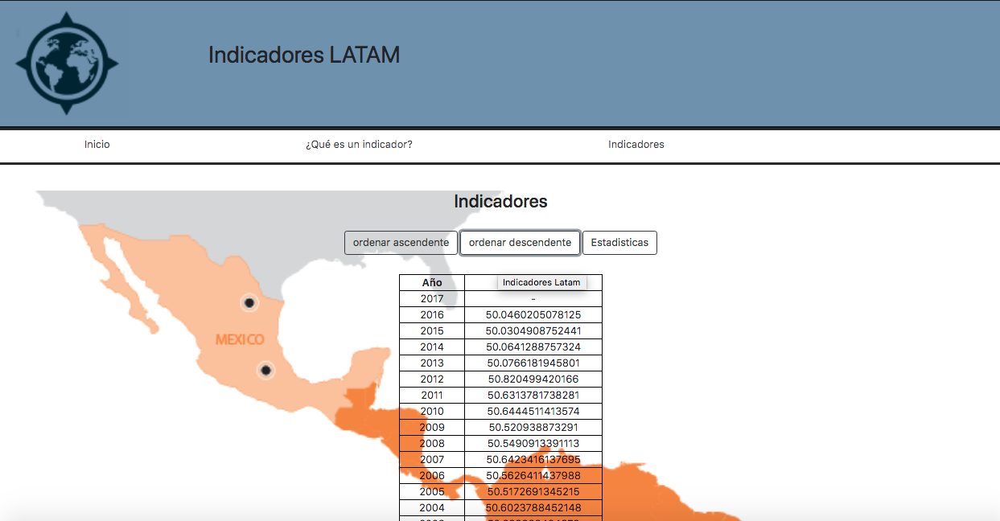

# Indicadores LATAM

## Introducción

La migración humana se puede afirmar como un proceso común y siempre presente a lo largo de la historia. Razones económicas, políticas, religiosas o de simple superación personal, han motivado durante siglos estos movimientos. Millones de personas se mueven en los puertos y aeropuertos, en las estaciones de tren, a través de fronteras vigiladas o no, y miles de ellas van en camino hacia algún nuevo destino al cual llamarán “hogar”, tal vez por siempre.

Las razones que motivan la determinación de dejar un país son complejas y varían de persona a persona. Sin embargo,la inseguridad social y personal, el desempleo, la no visualización de un futuro promisorio son algunas de las más populares. Cabe destacar también que la necesidad de buscar un nuevo hogar en el exterior responde, en muchos casos,a una crisis estructural (política o económica) en el país de origen.

## Indicadores LATAM

Indicadores LATAM tiene como objetivo brindarte la información de indicadores economicos, demograficos y sociales más relevante de Brasil, Chile, México y Perú, ya que aunque toda persona con empuje o la suficiente preparación puede alcanzar éxito en otro país, resulta recomendable evaluar las razones que motivan el interés en dejar el país de origen. Se debe analizar en profundidad las oportunidades reales que se tienen para establecerse en una nueva nación. Evaluar las fortalezas y debilidades es una buena práctica. Cuestionarse qué se debe mejorar en lo profesional o económico, qué se está dispuesto a sacrificar y qué cosas no se pueden dejar atrás.
Esperamos ser de gran ayuda para ti en esta descisión tan importante.

### Usuarios 

Nuestros usuarios son personas que buscan mudarse a Brasil, Chile, México o Péru.
Son futuros migrantes o migrantes que buscan un nuevo cambio, les gusta evaluar oportunidades, se preocupan por su futuro y por el impacto de las decisiones. Son personas que se mantiene informadas del entorno internacional.

## Diseño

### Diagrama de Flujo

### Sketch de baja fidelidad

La versión inicial la conformaban 2 pantallas:

**1. Página de filtros:**  contiene los dos filtros que consideramos importantes para poder ingresar a la data, al dar siguiente te muestra la lista de indicadores, donde puedes ordenarlos alfabéticamente, al seleccionar el indicador que te interesa te conduce a otra pantalla.

**2. Mostrar información:** Aquí te muestra la información histórica del indicador de tu interes, hay un botón de regresar para volver a la página de inicio, también uno de promedio para que te muestre tal y uno de gráfica el cual te muestra una gráfica creada con los datos.

De acuerdo al feedback recibido, se sugirió una pantalla en donde expliques cual es el objetivo de la página asi como una introducción a lo qué es un indicador. Además se nos comento qué esta pantalla contaba con demasiados botones en la parte de abajo por lo que era algo abrumador.

###  Sketch de alta fidelidad

Esta sección no incluye fotos, ya que compartimos al final el link en Figma y Zeplin, en donde podrás observar el trabajo de mejor manera.

La versión de alta fidelidad esta creada de la siguiente forma:

**1. Página de Inicio:**  en esta página pusimos una pequeña introducción a lo que es Indicadores LATAM, así como una pequeña explicación de qué es un indicador, con esto el usuario podrá entender más rápidamente el objetivo de la página. También agregamos un ménu en la parte superior para facilitar la navegación.

**2. Filtros:** En esta página seguimos el formato de filtros, ya que fueron bien recibidos, conservamos el botón siguiente, el cual al dar click desliza la lista de indicadores disponibles, conservamos el botón de orden alfabético.

**3. Indicadores:** conservo el formato inicial, sin embargo con el ménu de navegación pudimos disminuir los botones de abajo para mejorar el espacio visual, conservamos los botones de la gráfica y el promedio.

Después de realizar esta versión, los feedback indicaron que la primer pantalla contenia mucho texto yq ue los botones de ordenar eran demasiado pequeños.

[Figma](https://www.figma.com/file/K3fbFcsHsHs7Z2xTWSGCNlR4/Indicadores-LATAM?node-id=0%3A1)

[Zeplin](https://zpl.io/scene/VkGvz45)

###  Diseño final
**-Sección Inicio** 
El contenido permanecio, es decir muestra el objetivo del proyecto, la difernecia es que se separo de la pantalla de la explicación del indicador.

**-Sección ¿Qués es un indicador?** 
Te da un acercamiento a los indicadores y porqué deberías considerarlos para tomar la decisión de mudarte, se separo de la pantalla inicial, debido al feedback recibido.

**-Sección Indicadores** 
   1. Se muestra el filtro a aplicar, el primero te pregunta en que país estas interesado y el segundo si eres hombre o mujer, esto debido a que hay indicadores específicos para el género y por lo tanto podrían ser de mayor interés los que se identifica con tu género.

  2. Una vez filtrado, te mostrará la lista de indicadores disponibles, en esta sección, te da la opción de ordenarlos alfabéticamente para facilitar la busqueda,una vez que selecciones el indicador de tu interés podras dar click en siguiente para que te muestre la información.En cuanto al formato ampliamos la ventana donde se ven los indicadores para la mejor lectura del usuario.

  3. En esta pantalla te muestra la información histórica del indicador de tu interés, te permite ordenarlo del año mas reciente al más antiguo y viceversa. También te permite calcular algunas de las estadisticas más populares como son el promedio, mediana, máximo y minimo.

## Test Usabilidad

[Videos Loom](https://useloom.com/share/folder/4474fe9dda3c4d73a6704687fdc5d718)
[Video1 YouTube](https://youtu.be/z6haUDAdULY)
[Video2 YouTube](https://youtu.be/HNxapmtIcn4)

## Deploy

[Indicadores LATAM]()

**Conclusiones** 

- Pudimos observar que los usuarios se confunden en la página de inicio, ya que al apretar el botón "Inicio" pensaban que no funcionaba, aquí se sugirió agregar el titulo "Inicio" a la sección para evitar la confusión.

- Los botones de ordenar fueron muy bien recibidos, ya que facilitaban la busqueda de la información.

- Más filtros fueron sugeridos ya que la lista de indicadores parece abrumadora(mucho texto).

- Los indicadores que no tienen información deben ser removidos ya que el usuario espera ver información y cuando no la ven , genera algo de desconfianza y confusión de porqué se esta mostrando ese indicador si no contiene nada relevante.

- En la pantalla donde se muestra la lista de indicadores se debe poner el titulo del indicador que se seleccionó, ya qué lo olvidan y génera conflicto volver a buscarlo de nuevo.

- En la tabla (año/indicador) en la parte de indicador debería ir al lado de cada indicador un comentario a que pertenece el dato (por ej. si es en % poderle al lado el simbolo)

- Los colores de la pagina, fueron bien recibidos, ya que les dan tranquilidad y hacen más entretenida una pagina con tanta información 

- Fue de gran utilidad poder ordenar la tabla (año/indicador) de manera ascendente y descendente, ya que permite ver los punto con más indicadores disponibles, en caso de que en los primeros años no hubieran datos pero si en los últimos

## Planeación

[Tablero Trello](https://trello.com/invite/b/VwgQj4sx/e8953407ee31a5538753348ace769f28/data-lovers)

